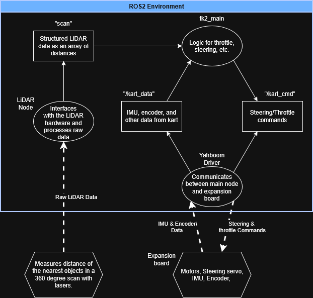

# Tinykart design overview
**Packages:**
- rplidar_ros
    - Code for LiDAR
- tf2_transforms
    - Sets up the transformation frames between different parts of the kart
- tk2_main
    - place to write main logic of the kart
- tk2_msgs
    - has custom message formats for Tinykart
- v4l2_camera
    - node to accept camera inputs
- yahboom_driver
    - Code to interface with the expansion board on the kart which actuates the motors and servos, as well as reports things like IMU data

 **Node Diagram:**
 
 - Nodes are the ovals
 - Topics are the rectangles
 - Hexagons are hardware