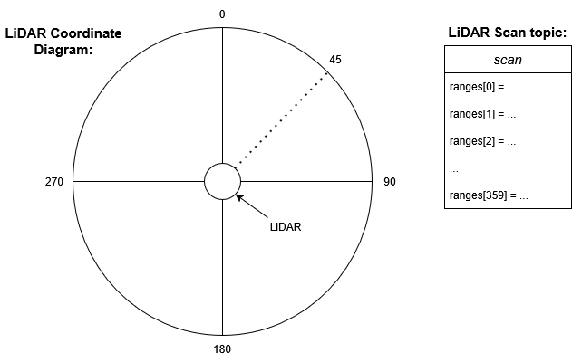
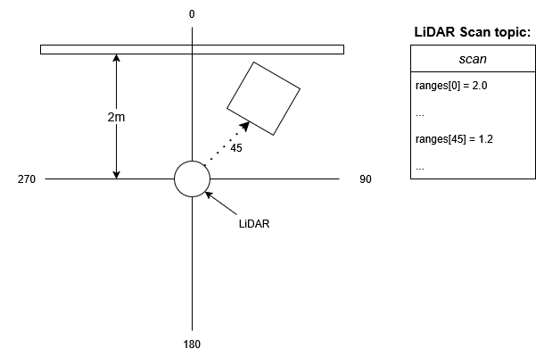

# LiDAR Overview

**LD19 LiDAR**:

This is the LiDAR that will be on your tinykarts. It can scan 360 degrees with 1 degree accuracy up to 12 meters (with decrecing amounts of reliability as range increases!).

The LiDAR node will output data to a **sensor_msgs::LaserScan** message format: https://docs.ros.org/en/jazzy/p/sensor_msgs/msg/LaserScan.html

*Note: Tinykart2 was developed using a different LiDAR (rplidar C1). However LiDARs are expensive and we already have a lot of LD19's in our inventory, which is why the "production" versions of Tinykart2 have them. Depending on when you view this repository, you may find the code for the C1, which works very similar to the LD19*

**Data from the LD19:**

The LD19 LiDAR will measure the distance to the nearest object in 360 degrees around a flat plane around the LiDAR. This will be output to the `"scan"` topic in Tinykart in the **sensor_msgs::LaserScan** message format: https://docs.ros.org/en/jazzy/p/sensor_msgs/msg/LaserScan.html

The `ranges[]` field in the **LaserScan** message is an array of float values for distance in meters. The value at index *n* will be the range at the angle *n* in degrees clockwise from straight in-front of the lidar.

